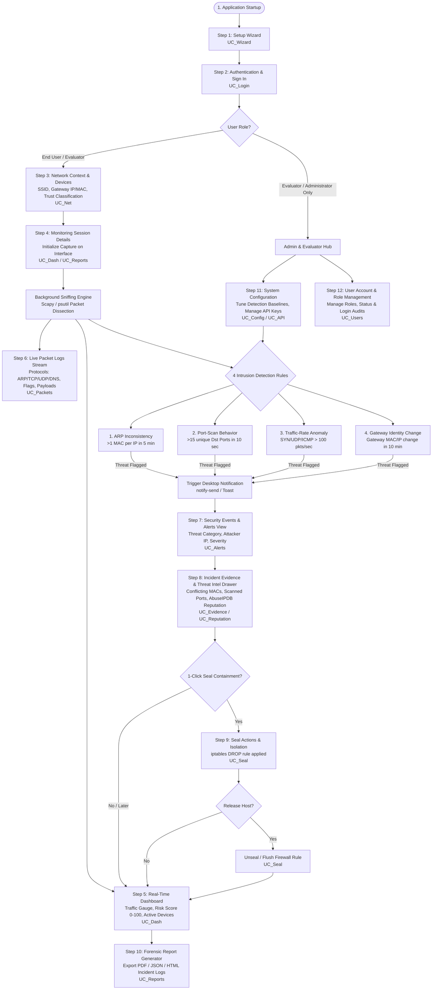
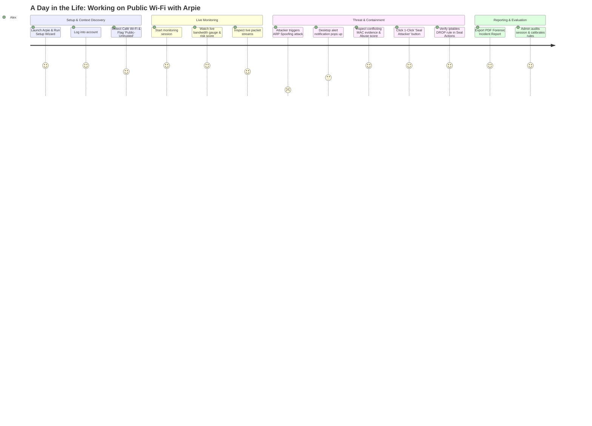
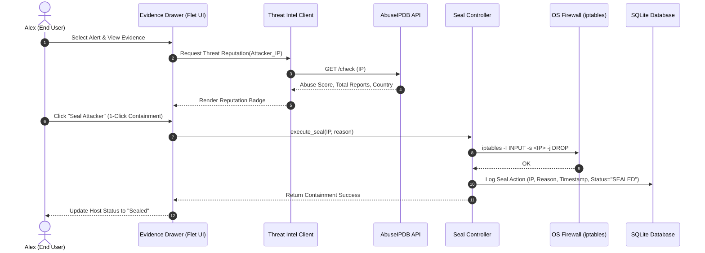

# Arpie: System Flow & Architecture Guide

## Overview

This guide maps the system flow, component architecture, and use case realizations for **Arpie: A Context-Aware Endpoint Network Intrusion Detection and Threat-Response System for Public Wi-Fi**, aligning the academic deliverables from `IT21_2nd Deliverables_UI.pdf` with the implementation in the codebase.

---

## 1. End-to-End System Flowchart



---

## 2. Interactive User Journey: The Story of Arpie in Action

To understand how a user experiences Arpie in the real world, follow this scenario featuring **Alex** (a university student working at a public café Wi-Fi) and **Professor Morgan** (the academic evaluator & administrator).



---

### Act I: The Onboarding & Context Discovery
1. **The Setting**: Alex sits down at a busy public coffee shop, connects a laptop to the open Wi-Fi network (`"Cafe_Guest_WiFi"`), and launches **Arpie**.
2. **First Run (Setup Wizard — `UC_Wizard`)**: 
   - Arpie greets Alex with a sleek onboarding check.
   - The wizard verifies raw socket privileges, binds to the wireless interface (`wlan0`), and confirms the local SQLite database is ready.
3. **Sign-In (`UC_Login`)**: 
   - Alex enters credentials. The system authenticates Alex as an `End User` and transitions to the main dashboard.
4. **Context Discovery (`UC_Net`)**: 
   - Arpie inspects the environment. It detects the SSID `"Cafe_Guest_WiFi"`, resolves the default gateway (`192.168.1.1` @ `00:11:22:33:44:55`), and assigns a **`public-untrusted`** rating.
   - The **Network Context & Devices** table populates with 14 other laptops and smartphones discovered on the subnet.

---

### Act II: Active Passive Monitoring
5. **Starting the Session (`UC_Dash`, `UC_Reports`)**:
   - Alex clicks **"Start Monitoring"**. A new session (`#SESS-037`) begins.
6. **Watching the Real-Time Dashboard (`UC_Dash`)**:
   - The **Traffic Speed Gauge** displays live throughput (e.g. `120 KB/s`).
   - The **Session Risk Score** rests safely at `0/100 (Safe - Green)`.
   - The category breakdown shows `0` threats detected.
7. **Peeking at the Packet Logs (`UC_Packets`)**:
   - Alex navigates to **Packet Logs** and sees a live stream of network packets scrolling by with clean protocol tags (`ARP`, `TCP`, `DNS`), TCP control flags (`SYN`, `ACK`), and packet lengths.

---

### Act III: The Attack & The Defense
8. **The Intrusion Occurs**:
   - A rogue laptop on the café network (`192.168.1.88`) starts an **ARP Cache Poisoning** attack, broadcasting fake ARP replies claiming it is the default gateway.
9. **Instant Alert & Notification (`UC_Alerts`)**:
   - Within milliseconds, Arpie’s **ARP Identity Inconsistency Analyzer** catches that IP `192.168.1.1` is now claiming a new MAC address (`AA:BB:CC:DD:EE:FF`) within a 5-minute window.
   - A desktop notification immediately fires: *"High Severity Threat Detected: ARP Spoofing by 192.168.1.88"*.
   - In the **Security Events & Alerts** view, a bright red `HIGH` alert appears. The **Session Risk Score** jumps to `85/100 (Critical Risk)`.
10. **Forensic Evidence & Threat Intel (`UC_Evidence`, `UC_Reputation`)**:
   - Alex clicks the alert row. The **Incident Evidence & Threat Intel Drawer** slides open.
   - *Technical Proof*: A clear side-by-side comparison showing Gateway IP `192.168.1.1` originally mapped to `00:11:22:33:44:55`, but suddenly claimed by `AA:BB:CC:DD:EE:FF`.
   - *Threat Intel*: Arpie performs an async lookup to `AbuseIPDB`, fetching an external reputation rating and country flag.
11. **Executing 1-Click Seal Mode (`UC_Seal`)**:
   - Below the evidence, Alex clicks the bold blue button: **"Seal Attacker"**.
   - Arpie immediately invokes `arpie/seal.py`, inserting an OS-level firewall rule:
     ```bash
     iptables -I INPUT -s 192.168.1.88 -j DROP
     ```
   - The attacker is instantly isolated. In the **Seal Actions** screen, `192.168.1.88` is listed as `STATUS: SEALED`.
   - The risk score normalizes, and Alex continues working without fear of credential theft or session hijacking. If needed later, Alex can click **"Unseal"** with a single click to restore normal communication.

---

### Act IV: Reporting & Administrative Evaluation
12. **Exporting Forensic Evidence (`UC_Reports`)**:
   - Before packing up, Alex navigates to the **Reports** section and clicks **"Export PDF"**.
   - Arpie uses `ReportLab` to compile the entire session chronology, network context, packet logs, evidence matrix, and seal audit trail into a styled forensic PDF report (`arpie_session_37.pdf`).
13. **The Administrator & Evaluator Role (`UC_Users`, `UC_Config`, `UC_API`)**:
   - **Professor Morgan** logs in using an `Evaluator / Administrator` account.
   - In **User Account Management**, Professor Morgan audits student accounts and permission levels.
   - In **System Configuration**, Professor Morgan calibrates detection sensitivity (adjusting port scan threshold or packet flood baselines) and configures `AbuseIPDB` / `IPinfo Lite` API credentials.
   - Using the **PCAP Replay Launcher**, Professor Morgan replays synthetic attack captures offline to test and grade detector accuracy under controlled conditions.

---

## 3. Deliverable UI vs. Use Case vs. Codebase Mapping Matrix

| Deliverable UI Component (PDF Specification) | Target Role | Use Case ID | Purpose & Deliverable Description | Implementation Codebase File(s) |
| :--- | :--- | :--- | :--- | :--- |
| **Authentication & Setup Wizard** | End User & Admin | `UC_Login`<br/>`UC_Wizard` | Authenticates users, validates role assignments, and initializes the first-run configuration wizard. | `arpie/ui/views/login.py`<br/>`arpie/db.py` |
| **Real-Time Threat Monitoring Dashboard** | End User & Admin | `UC_Dash` | Shows a live overview of network activity: traffic speed gauge, 0–100 session risk score, detected attack categories, and most active network devices. | `arpie/ui/views/dashboard.py`<br/>`arpie/risk.py`<br/>`arpie/ui/components/` |
| **Security Events & Alerts** | End User & Admin | `UC_Alerts` | Tabular display of all detected threats detailing detection time, attack type, severity rating, attacker IP/MAC, target device, and alert status. | `arpie/ui/views/alerts.py`<br/>`arpie/detection/__init__.py` |
| **Incident Evidence Details & Threat Intelligence** | End User & Admin | `UC_Evidence`<br/>`UC_Reputation` | Explanatory side panel providing technical proof (conflicting MAC addresses, scanned port lists), AbuseIPDB reputation scores, country flags, and a 1-click isolation button. | `arpie/threat_intel.py`<br/>`arpie/ui/views/alerts.py` |
| **Network Context & Devices** | End User & Admin | `UC_Net` | Displays connected Wi-Fi SSID, default gateway IP/MAC, network trust classification, and an inventory table of discovered local hosts. | `arpie/network_context.py`<br/>`arpie/capture.py` |
| **Monitoring Session Details** | End User & Admin | `UC_Dash`<br/>`UC_Reports` | Displays active session parameters: Session ID, active network interface, operator name, start/end timestamps, total duration, and calculated risk rating. | `arpie/db.py`<br/>`arpie/report.py` |
| **Packet Logs** | End User & Admin | `UC_Packets` | Live streaming table of captured network packets (timestamp, source/destination IP, protocols [ARP, TCP, UDP, DNS], packet size, TCP flags, and payload summary). | `arpie/capture.py`<br/>`arpie/db.py` |
| **Seal Actions (Containment)** | End User & Admin | `UC_Seal` | Lists all suspect devices blocked/quarantined by the system with isolation reason, timestamp, status, and 1-click manual unblock action. | `arpie/seal.py`<br/>`arpie/ui/views/seal.py` |
| **User Account Information** | Evaluator / Admin | `UC_Users` | Table of registered accounts listing user IDs, full names, usernames, emails, assigned roles (`Evaluator / Administrator` vs `End User`), account status, and last login timestamps. | `arpie/ui/views/users.py`<br/>`arpie/db.py` |
| **System Configuration** | Evaluator / Admin | `UC_Config`<br/>`UC_API` | Allows administrators to adjust detection sensitivity (traffic rate limits, port scan windows) and enter API keys for AbuseIPDB and IPinfo Lite. | `arpie/config.py`<br/>`arpie/ui/views/settings.py` |
| **Forensic Report Generator** | End User & Admin | `UC_Reports` | Exports structured forensic audit reports containing session summaries, detected security events, and technical evidence in PDF, HTML, and JSON formats. | `arpie/report.py`<br/>`arpie/ui/components/` |

---

## 4. Detection Techniques & Configurable Thresholds

The core detection engine runs 4 deterministic rules designed for public Wi-Fi environments:

| # | Detection Technique | Rule Baseline & Threshold | Threat Identified |
| :-: | :--- | :--- | :--- |
| **1** | **ARP Identity Inconsistency** | 1 local IP associated with more than 1 MAC address within a **5-minute** window. | ARP Spoofing / Man-In-The-Middle (MITM) |
| **2** | **Port-Scan Behavior** | More than **15 unique destination ports** contacted by 1 source within a **10-second** window. | Reconnaissance / Host Port Scanning |
| **3** | **Traffic-Rate Anomaly** | SYN, UDP, or ICMP packets from 1 source exceeding **100 packets/second** (default baseline). | SYN Flood / UDP Flood / DoS Anomaly |
| **4** | **Gateway Identity Change** | Default gateway MAC/IP association changes more than once within a **10-minute** window. | Rogue Access Point / Gateway Hijacking |

---

## 5. Defense & Containment Subsystem (Seal Mode)



---

## 6. Professor Evaluation & Defense Quick Reference

When presenting the project to the evaluator:

1. **Explainability First**: Unlike black-box ML models, Arpie uses **deterministic rules** with clear evidence (conflicting MAC addresses, exact scanned ports, packet timestamps) presented in the **Incident Evidence Details & Threat Intel** view.
2. **Context-Aware Classification**: The system automatically classifies networks into `trusted`, `public-untrusted`, or `unknown` based on gateway MAC/SSID history to adjust threat sensitivity.
3. **Reversible Containment (Seal Mode)**: Host isolation is explicit, user-confirmed, and fully reversible via the **Seal Actions** screen.
4. **Offline Validation & Replay**: Demonstrations can be reproduced deterministically using the built-in **PCAP Replay mode** without needing active attacks or root privileges on public networks.
