# Arpie System Architecture & Component Specification

## Overview

**Arpie** is a context-aware endpoint network intrusion detection and threat-response system designed for public Wi-Fi security. It provides deterministic attack detection, threat intelligence enrichment, explainable forensic evidence, and 1-click host isolation (Seal Mode).

---

## High-Level System Architecture

```mermaid
graph TB
    subgraph Actors ["Actors"]
        EU["End User (Student / Remote Worker / SOHO)"]
        ADMIN["Evaluator / Administrator"]
        EXT_INTEL["External Threat Intel (AbuseIPDB & IPinfo Lite API)"]
        OS_FIREWALL["OS Firewall & Notification Subsystem (iptables / notify-send)"]
    end

    subgraph UI_Layer ["Presentation & UI Layer (Flet Framework)"]
        LOGIN["Authentication & Setup Wizard"]
        DASH["Real-Time Threat Monitoring Dashboard"]
        ALERTS["Security Events & Alerts View"]
        EVIDENCE["Incident Evidence Details & Threat Intel Drawer"]
        NET_CTX["Network Context & Connected Devices"]
        PACKETS["Live Packet Capture Stream"]
        SEAL_VIEW["Seal Actions & Host Isolation"]
        SESS_VIEW["Monitoring Session Details"]
        USER_MGT["User Account & Role Management"]
        CONFIG_VIEW["System Configuration & Threshold Tuning"]
        REPORTS["Forensic Report Generator (ReportLab)"]
    end

    subgraph Core_Engine ["Detection Engine (Python / Scapy / psutil)"]
        SNIFFER["Packet Sniffer & Parser"]
        
        subgraph Detectors ["Intrusion Detectors"]
            D1["1. ARP Identity Inconsistency Analyzer"]
            D2["2. Port-Scan Behavior Detector"]
            D3["3. Traffic-Rate Anomaly Detector"]
            D4["4. Gateway Identity Change Monitor"]
        end

        SIMULATOR["PCAP Replay & Threat Calibration Engine"]
    end

    subgraph Response_Layer ["Response & Orchestration Engine"]
        SEAL_CTRL["Seal Mode Controller (iptables)"]
        NOTIF_MGR["Notification Dispatcher (notify-send)"]
        INTEL_CLIENT["Threat Intel Client (AbuseIPDB / IPinfo Lite)"]
    end

    subgraph Storage_Layer ["Storage Layer (SQLite)"]
        DB_USERS[("User Accounts & Roles")]
        DB_ALERTS[("Security Events & Alerts")]
        DB_EVIDENCE[("Incident Evidence Details")]
        DB_INTEL[("Threat Intel Cache")]
        DB_DEVICES[("Network Context & Devices")]
        DB_SESSIONS[("Monitoring Session Details")]
        DB_PACKETS[("Packet Logs")]
        DB_SEAL[("Seal Actions")]
        DB_CONFIG[("System Configuration")]
    end

    EU --> LOGIN
    EU --> DASH
    EU --> ALERTS
    EU --> EVIDENCE
    EU --> NET_CTX
    EU --> PACKETS
    EU --> SEAL_VIEW
    EU --> REPORTS

    ADMIN --> EU
    ADMIN --> LOGIN
    ADMIN --> USER_MGT
    ADMIN --> CONFIG_VIEW
    ADMIN --> SIMULATOR
    ADMIN --> SESS_VIEW
    ADMIN --> REPORTS

    LOGIN <--> DB_USERS
    CONFIG_VIEW <--> DB_CONFIG
    USER_MGT <--> DB_USERS
    DASH <--> DB_SESSIONS
    DASH <--> DB_ALERTS
    ALERTS <--> DB_ALERTS
    EVIDENCE <--> DB_EVIDENCE
    NET_CTX <--> DB_DEVICES
    PACKETS <--> DB_PACKETS
    SEAL_VIEW <--> DB_SEAL
    REPORTS <--> DB_SESSIONS
    REPORTS <--> DB_EVIDENCE

    SNIFFER --> Detectors
    SNIFFER --> DB_PACKETS
    Detectors --> DB_ALERTS
    Detectors --> DB_EVIDENCE
    Detectors --> NOTIF_MGR
    
    SIMULATOR --> Detectors

    EVIDENCE --> INTEL_CLIENT
    INTEL_CLIENT <--> EXT_INTEL
    INTEL_CLIENT --> DB_INTEL

    SEAL_VIEW --> SEAL_CTRL
    SEAL_CTRL <--> OS_FIREWALL
    SEAL_CTRL --> DB_SEAL

    NOTIF_MGR --> OS_FIREWALL
```

---

## Component Breakdown

| Component | Target Role | Key Responsibilities | Technologies |
| :--- | :--- | :--- | :--- |
| **Authentication & Setup Wizard** | End User & Admin | User sign-in, authentication, role verification, and initial system onboarding setup wizard. | Flet, SQLite |
| **Real-Time Threat Monitoring Dashboard** | End User & Admin | Visualizes live network traffic speed, overall session risk score (0–100), detected attack categories, and active local devices. | Flet, psutil, SQLite |
| **Security Events & Alerts** | End User & Admin | Tabular listing of security events detailing detection time, attack type, severity, attacker/target IP/MAC, and status. | Flet, SQLite |
| **Incident Evidence Details & Threat Intel** | End User & Admin | Explanatory side panel displaying technical proof (MAC conflict matrix, scanned port lists), AbuseIPDB reputation scores, and quick isolation triggers. | Flet, AbuseIPDB API, IPinfo Lite API |
| **Network Context & Devices** | End User & Admin | Discovers local network topology, Wi-Fi SSID, Gateway IP/MAC binding, and network trust level. | Scapy, SQLite |
| **Packet Logs** | End User & Admin | Live stream of captured network packets (timestamp, source/destination IP, protocol, packet size, TCP flags, header metadata). | Scapy, SQLite |
| **Seal Actions (Containment)** | End User & Admin | Manages host isolation: displays blocked hosts, containment reasons, timestamps, and 1-click unblock capability. | `iptables`, Flet, SQLite |
| **User Account & Role Management** | Evaluator / Admin | Administrative control of user accounts, roles (`Evaluator / Administrator` vs `End User`), account status, and login audit logs. | Flet, SQLite |
| **System Configuration & Thresholds** | Evaluator / Admin | Calibrates detection thresholds (packet rates, port scan windows, ARP mismatch timing) and external threat intel API keys. | Flet, SQLite |
| **PCAP Replay & Attack Simulator** | Evaluator / Admin | Offline testing suite to replay malicious PCAP traces and validate detection accuracy against calibrated rules. | Scapy, pytest, PCAP Files |
| **Forensic Report Generator** | End User & Admin | Generates structured forensic audit exports in PDF, HTML, and JSON formats. | ReportLab, SQLite |

---

## Detection Techniques & Rules

1. **ARP Identity Inconsistency**: Detects if one local IP is associated with more than one MAC address within a 5-minute window.
2. **Port-Scan Behavior**: Flags when more than 15 unique destination ports are contacted by a single source within a 10-second window.
3. **Traffic-Rate Anomaly**: Flags SYN/UDP/ICMP packet rates exceeding 100 packets/second (configurable baseline).
4. **Gateway Identity Change**: Identifies when the default gateway MAC/IP association changes more than once within a 10-minute window.
